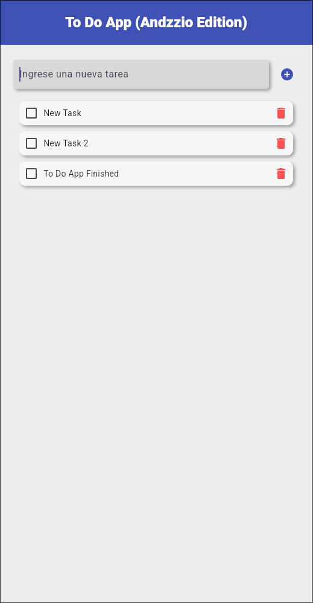

# Flutter Fullstack To-Do App (Andzzio Edition)

A robust and modern task management application, built with a real Fullstack architecture separated into two layers. This project serves as a demonstration of the integration between Flutter and Python (FastAPI).



## 🏗️ Architecture

- **Frontend:** Flutter (Mobile App)
  - State Management: `setState` + `FutureBuilder`.
  - Communication: `http` package.
  - Models: Manual JSON serialization.
- **Backend:** Python (FastAPI)
  - Database: SQLite (Persistent in `todo.db`).
  - ORM: SQLModel (Pydantic + SQLAlchemy).
  - Security: CORS Middleware configured.

## 🚀 Prerequisites

Ensure you have the following installed:

- **Flutter SDK** (Version 3.0 or higher).
- **Python** (Version 3.10 or higher).
- An Android/iOS emulator or a physical device.

---

## 🛠️ Setup & Installation

### 1. Backend (The Brain)

The backend must be running for the app to function.

1.  Navigate to the backend folder:

    ```bash
    cd backend
    ```

2.  (Optional but recommended) Create a virtual environment:

    ```bash
    python3 -m venv venv
    source venv/bin/activate  # On Windows: venv\Scripts\activate
    ```

3.  Install dependencies:

    ```bash
    pip install "fastapi[standard]" sqlmodel
    # Note: If using requirements.txt: pip install -r requirements.txt
    ```

4.  Start the server:
    ```bash
    uvicorn main:app --reload
    ```
    _The server will be listening at `http://127.0.0.1:8000`_

---

### 2. Frontend (The Face)

1.  Navigate to the app folder:

    ```bash
    cd to_do_app
    ```

2.  Install Flutter dependencies:

    ```bash
    flutter pub get
    ```

3.  Run the application:
    ```bash
    flutter run
    ```

---

## 📸 Gallery

Here you can place screenshots of how the application looks.

### Creating a Task


### Completed vs Pending Task


---

## 📝 Development Notes

- If using the **Android Emulator**, the API points to `http://10.0.2.2:8000`.
- If using **Web or iOS Simulator**, it points to `http://127.0.0.1:8000`.
- The `todo.db` database is automatically created in the `backend/` folder when the server starts.

---

Made with 💙 by Andzzio.
